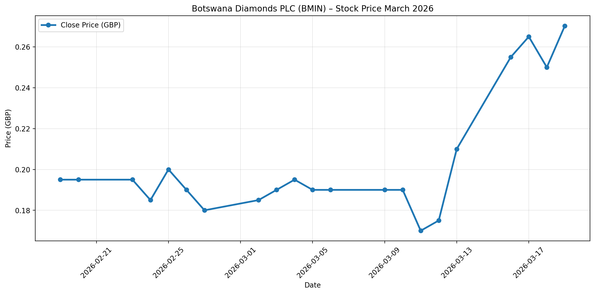
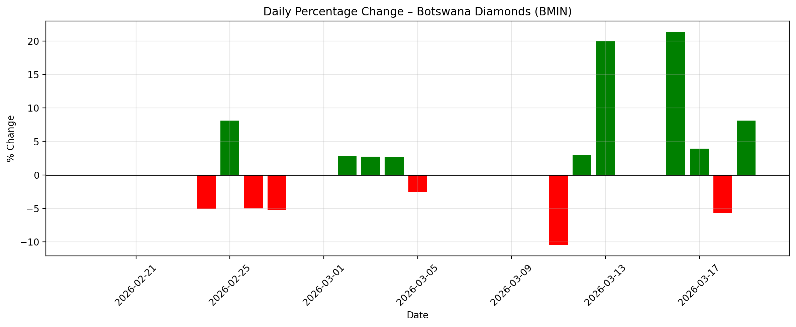

# Botswana Diamonds PLC (BMIN) Stock Analysis – March 2026

**Personal project**  
Mathematics of Finance student – University of Botswana

Analysis of daily stock price data (19 Feb – 19 Mar 2026) downloaded from Investing.com.

## Key Findings
- **Total return** over ~1 month: ≈ **+38.6%**  
- **Average daily return**: ≈ **+1.83%**  
- **Daily return volatility** (std dev): ≈ **7.7%** (very high — typical for junior mining/exploration stocks)  
- Noticeable rally in mid-March with several large daily moves

## Visualizations

### Price Trend

### Daily % Changes

## What's in this repository
- `*.ipynb` → full Jupyter/Colab notebook with data cleaning, calculations & plotting code  
- `price_chart.png` & `daily_returns_chart.png` → main output charts  
- `Botswana_Diamonds_Stock_History.csv` → raw downloaded data

## Tools used
Python · pandas · matplotlib · Google Colab

Data source: [Investing.com – Botswana Diamonds PLC](https://www.investing.com/equities/botswana-diamonds-plc)

Open the notebook to see the complete code and steps.
